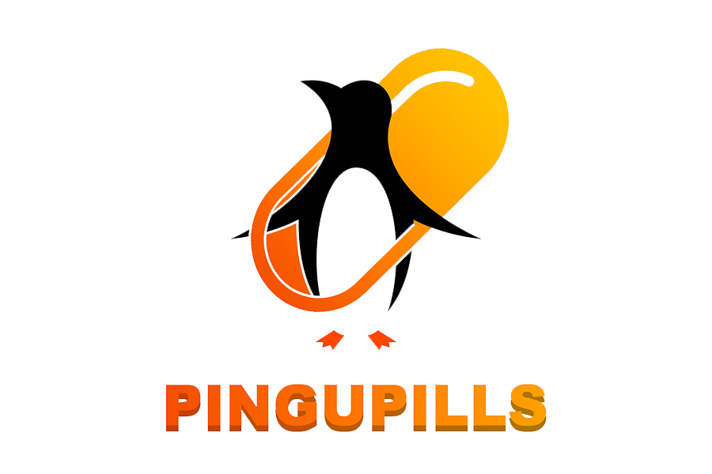
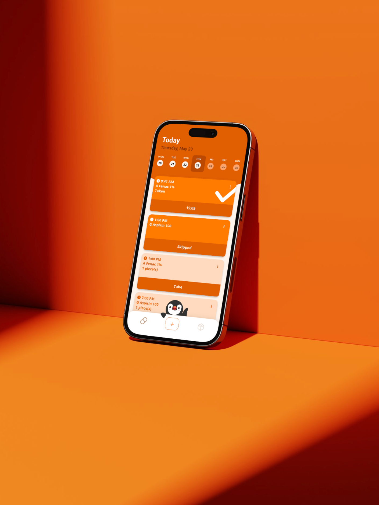
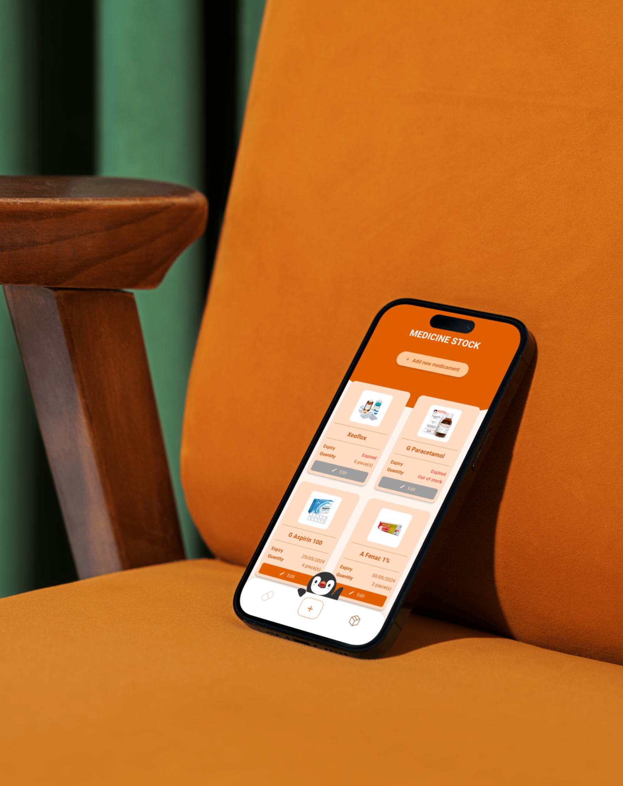

# PINGUPILLS 🐧

Struggling to remember your medication schedule or keep track of your pill count at home? `Look no further – PINGU has got you covered!`

With PINGU, you can set alarms to ensure you never miss a dose again and effortlessly keep track of your medicine stock.

🚀 Let's embrace a healthy lifestyle with __PINGUPILLS__!

## Features
- Keep track your medicament stock that you have at home
- Reminder for you to take your medications
- One click to have the medication marked as taken 
- Quick visualization of the remaining stock quantity and expiration date
- Notification for close to expiration day and stock replenishment
- A simple calendar to see medication intake in specific day

## Requirements
### Flutter SDK
- Flutter 3.3.0 or higher
- Dart SDK version: >=3.3.0 <4.0.0

## Product

## Acknowledgements

The logo was designed by Ricardo Yang.

The medicament database made by [WSAyan](https://github.com/WSAyan/medicinedb).

This project was developed for the "Engenharia de Software" (ES) course at @FEUP by team 2LEIC03T2 on May 2024:

- Bruno Huang   (up202207517)
- Ricardo Yang  (up202208465)

 

Special thanks to Professor [José Campos](https://sigarra.up.pt/feup/en/FUNC_GERAL.FORMVIEW?p_codigo=480945) for guidance and support throughout the course.
