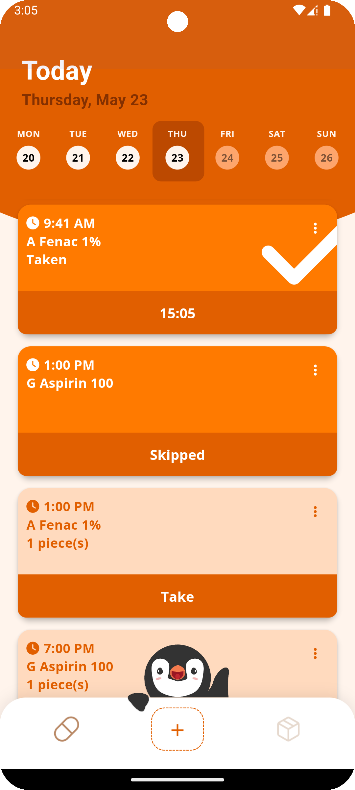
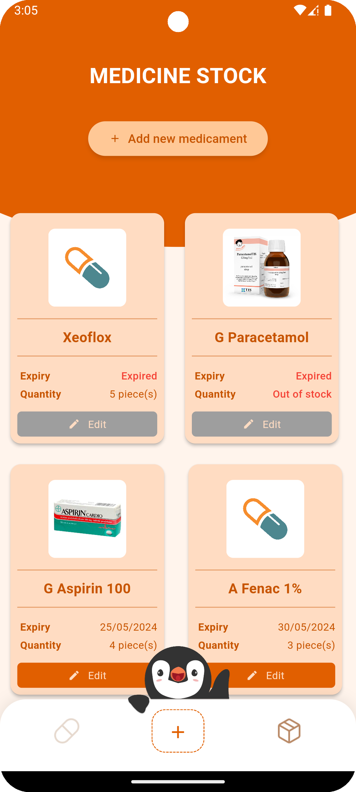
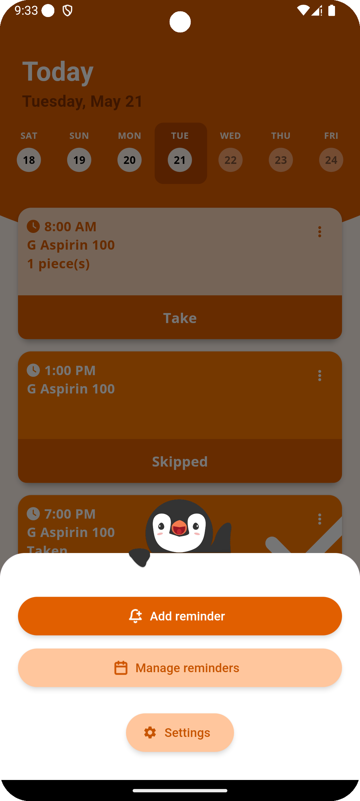
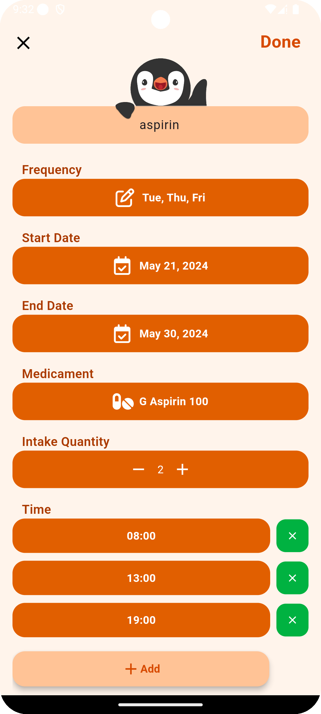
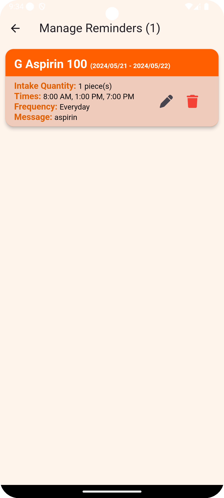
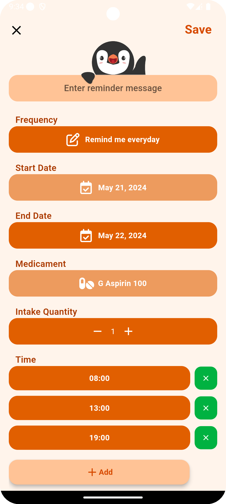
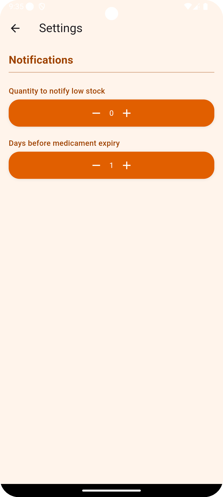
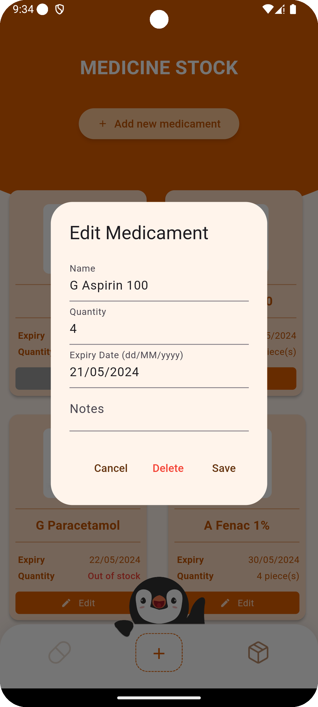
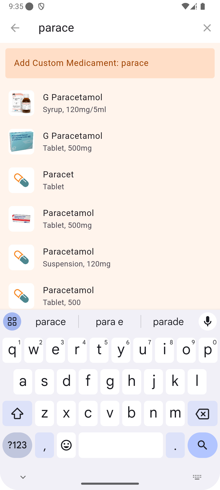
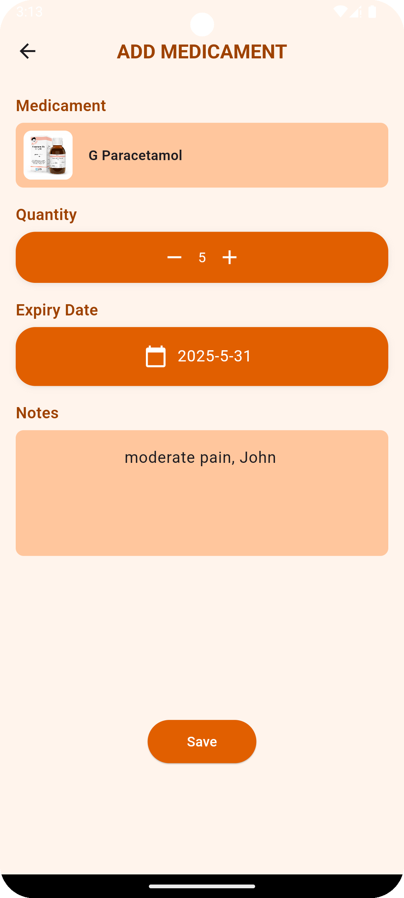

# PINGUPILLS 🐧

Struggling to remember your medication schedule or keep track of your pill count at home? Look no further – PINGU has got you covered! 

With PINGU, you can set alarms to ensure you never miss a dose again and effortlessly keep track of your medicine stock.

🚀 Let's embrace a healthy lifestyle with __PINGUPILLS__!

## Features
- Keep track of medications that you have at home
- Reminder for you to take your medications
- One click to have the medication marked as taken 
- Quick visualization of the remaining medication stock and expiration day
- Reminder for close to expiration day and stock replenishment
- A simple calendar to see medication intake in specific day

## Requirements
### Flutter SDK
- Flutter 3.3.0 or higher
- Dart SDK version: >=3.3.0 <4.0.0

## Screenshots

<b>Screenshot 1 - Reminders</b>

 

<b>Screenshot 2 - Stock</b>

 

<b>Screenshot 3 - Menu</b>

 

<b>Screenshot 4 - Add reminder</b>

 

<b>Screenshot 5 - Manage reminders</b>

 

<b>Screenshot 6 - Edit reminder</b>

 

<b>Screenshot 7 - Settings</b>

 

<b>Screenshot 8 - Edit medicament</b>

 

<b>Screenshot 9 - Search medicament</b>

 

<b>Screenshot 10 - Add medicament</b>

## Acknowledgements

The logo was designed by Ricardo Yang.

The medicament database made by [WSAyan](https://github.com/WSAyan/medicinedb).

This project was developed for the "Engenharia de Software" (ES) course at @FEUP by team 2LEIC03T2:

|  Name         |  ID         |
|---------------|-------------|
| Bruno Huang   | 202207517   |
| Ricardo Yang  | 202208465   |

 

Special thanks to Professor [José Campos](https://sigarra.up.pt/feup/en/FUNC_GERAL.FORMVIEW?p_codigo=480945) for guidance and support throughout the course.
