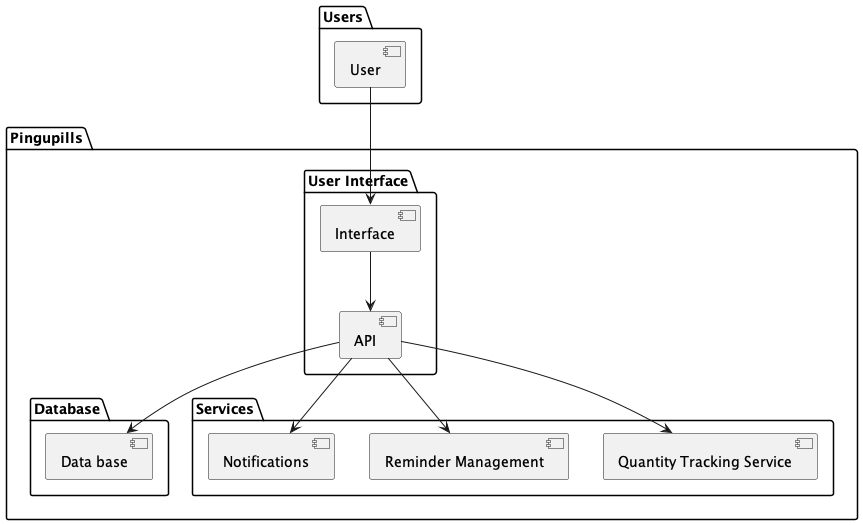
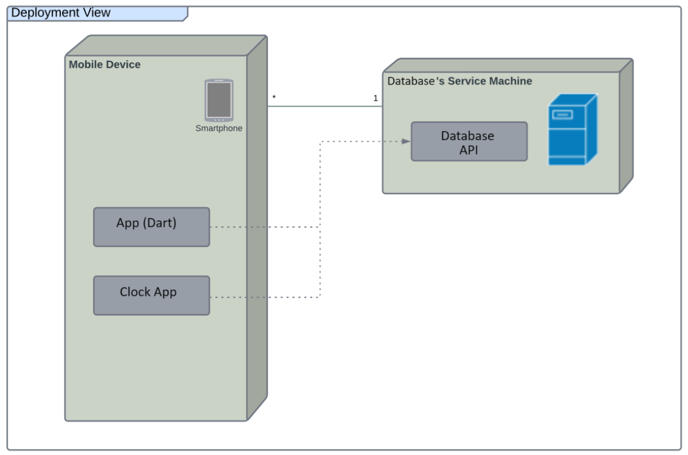

# PINGUPILLS

Struggling to remember your medication schedule? Unsure about your pill count at home? Look no further – PINGU has got you covered! Set alarms to ensure you never miss a dose again and effortlessly keep track of your medicine stock. 

Let's embrace a healthy lifestyle with __PINGUPILLS__!

[⚠️ Report Template ⚠️](https://github.com/FEUP-LEIC-ES-2023-24/templates/blob/main/README.md)

### 2LEIC03T2

- Bruno Huang - 202207517
- Diogo Pinto - 202205225
- Eriton Naife - 202008859
- Ricardo Yang - 202208465

### Features
- Keep track of medications that you have at home
- Reminder for you to take your medications
- One click to have the medication marked as taken 
- Quick visualization of the remaining medication stock and expiration day
- Reminder for close to expiration day and stock replenishment
- A simple calendar to see medication intake in specific day

## Requirements

### Domain Model

### Use Case Diagram

## Architecture and design

### Logical

### Physical

# Everything Below Move Later To Another Place

## User Stories
2. As a user, I expect the app to suggest medications when I'm adding them to the stock (like an autofill feature).
3. As a user, I want the app to automatically assign an image to the medication I add, but I also want the option to add my own image if necessary.
4. As a user, I want to log the time period for taking the medication, including the initial time I took it.
6. As a user, I want the app to notify me at the scheduled time to take the medication.
7. As a user, I want the option to be reminded later (e.g., 5 minutes later) to take the medication or mark as taken.
8. As a user, after marking the medication as taken, I want to see the remaining quantity (e.g., 18/20 antibiotics, the app should decrease automatically).
9. As a user, I want to receive a notification about a specified number of days before a medication expires, moving the medication to a historical section after expiration.
10. As a user, I want to be reminded when the medication is running low to replenish the stock.
11. As a user, I want the option to cancel a scheduled medication intake or to cancel a missclick as medication taken.
12. As a user, I want to view statistics or history regarding my medication intake.
13. As a user, I want the app to support dark mode and other theme options for customization.

## Project Requirement
3-5 different screens

