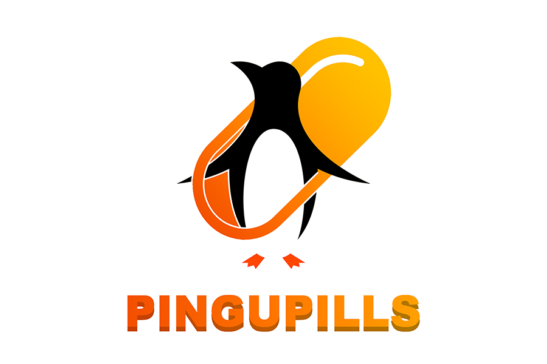
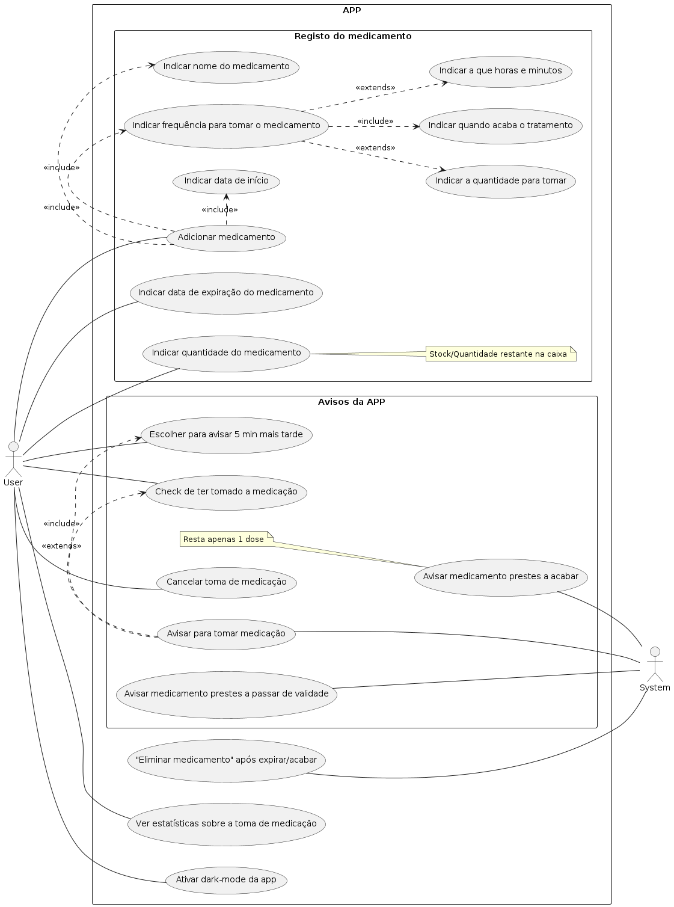

# PINGUPILLS
### 2LEIC03T2

## Overview
Struggling to remember your medication schedule? Unsure about your pill count at home? Look no further – PINGU has got you covered! Set alarms to ensure you never miss a dose again and effortlessly keep track of your medicine stock. 

Let's embrace a healthy lifestyle with __PINGUPILLS__!

## Use Case Diagram

## User Stories
1. As a user, I want to add medications to the app's stock and specify the remaining quantity and expiration date.
2. As a user, I want to specify the remaining quantity of my medications.
3. As a user, I want to be able to record the expiration date of my medications.
4. As a user, I expect the app to suggest medications when I'm adding them to the stock (like a autofill feature).
5. As a user, I want the app to automatically assign an image to the medication I add, but I also want the option to add my own image if necessary.
6. As a user, I want to log the time period for taking the medication, including the initial time I took it.
7. As a user, I want the app to notify me at the scheduled time to take the medication.
8. As a user, I want the option to be reminded later (e.g., 5 minutes later) to take the medication or mark as taken.
9. As a user, after marking the medication as taken, I want to see the remaining quantity (e.g., 18/20 antibiotics, the app should decrease automatically).
10. As a user, I want to receive a notification a specified number of days before a medication expires, moving it to a historical section.
11. As a user, I want to be reminded when the medication is running low to replenish the stock
12. As a user, I want the option to cancel a scheduled medication intake or to cancel a missclick as medication taken.
13. As a user, I want to view statistics or history regarding my medication intake.
14. As a user, I want the app to support dark mode and other theme options for customization.

## Project Requirement
3-5 different screens
