# PINGUPILLS 🐧

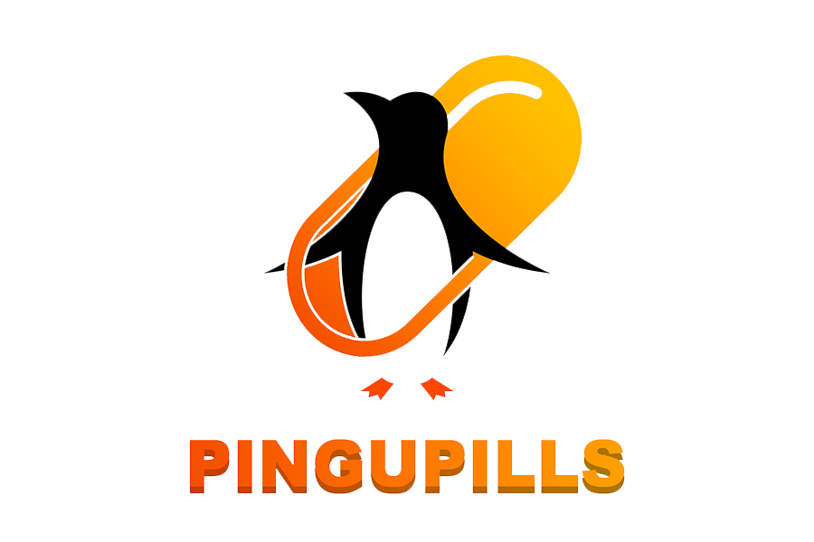

Struggling to remember your medication schedule? Unsure about your pill count at home? Look no further – PINGU has got you covered! Set alarms to ensure you never miss a dose again and effortlessly keep track of your medicine stock. 

🚀 Let's embrace a healthy lifestyle with __PINGUPILLS__!

## Team 2LEIC03T2

|  Name         |  ID         |
|---------------|-------------|
| Bruno Huang   | 202207517   |
| Diogo Pinto   | 202205225   |
| Ricardo Yang  | 202208465   |

## Features
- Keep track of medications that you have at home
- Reminder for you to take your medications
- One click to have the medication marked as taken 
- Quick visualization of the remaining medication stock and expiration day
- Reminder for close to expiration day and stock replenishment
- A simple calendar to see medication intake in specific day

## Requirements

### Domain Model
- `Medication`: Represents individual medications, including attributes like name, quantity, expiration date, and associated images.
- `Prescription`: Describes prescription details such as dosage frequency, quantity, and duration. Each medication can have multiple prescriptions.
- `Reminder`: Stores reminder settings linked to prescriptions, specifying reminder time and type. Multiple reminders can be associated with a single prescription.
- `Preferences`: Holds user-specific preferences, such as theme settings.
- `User`: Represents user information, including name. Users can have multiple medications associated with them.
- `MedicationExpirationNotification`: Tracks medication expiration status and allows setting notification days before expiry. Each medication has an associated expiration notification.
- `MedicationLowStockNotification`: Manages medication stock status, including low stock and out-of-stock notifications. Each medication has an associated low stock notification.

### Use Case Diagram

## Architecture and design

### Logical
Users engage through an **User Interface (UI)**, managing medication routines effortlessly. The **Reminder feature** allows users to set and manage medication schedules seamlessly. **Medication Stock** ensures a continuous supply of medications. The **Local Database** stores personalized data like reminder settings and medication inventory locally on the device.

The application extends its capabilities by integrating with a **Realtime Database** from **Firebase**. This integration enables **seamless synchronization** of medication information across users, providing access to **up-to-date medication details**.

### Physical
The **mobile device** acts as **interaction platform** between the **user** and the **system**, hosting essential components such as the **Dart-based application**. **User-specific data** is stored directly on the device through a **Local Database**, ensuring **quick access** and **optimized performance**. Integration with **Google Firebase** enhances the system with **cloud-based services**, facilitating **seamless communication** and **data synchronization** across devices.

- The **Firebase API** facilitates communication between the application and **Firebase services**.
- The **Realtime Database** acts as a **centralized repository**, ensuring **real-time synchronization** across devices and enhancing functionality.

## Sprint Backlogs

### Beginning 
<table>
  <tr>
    <td align="center">
      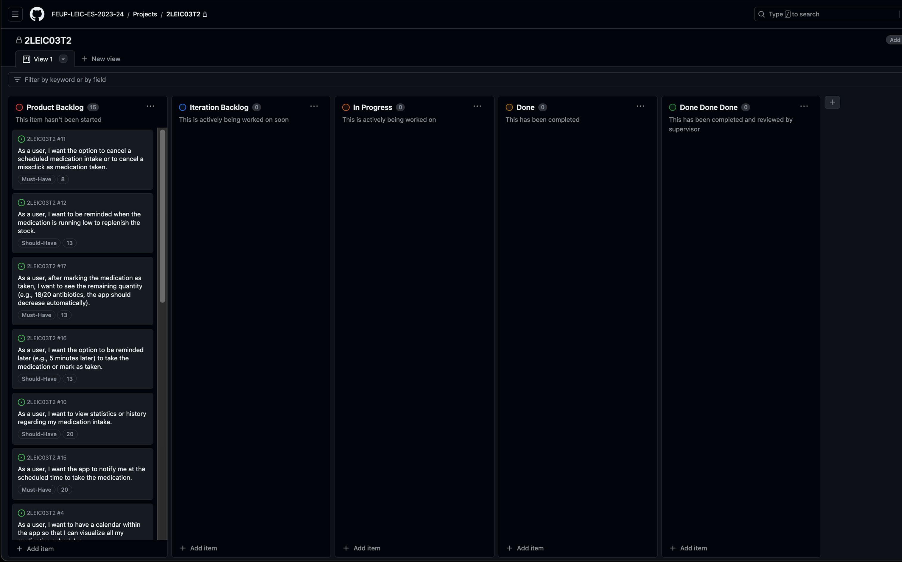
      
Beginning 0

    </td>
    <td align="center">
      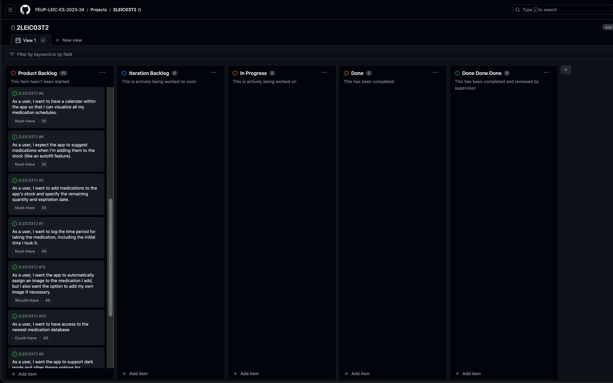
      
Beginning 1

    </td>
    <td align="center">
      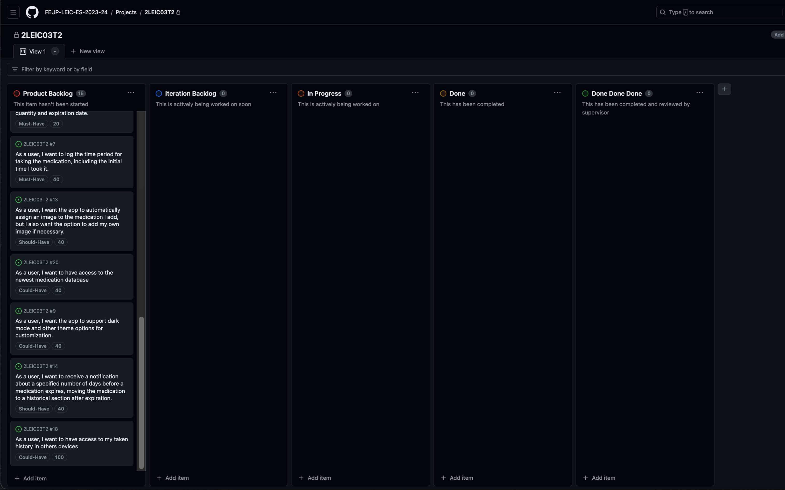
      
Beginning 2

    </td>
  </tr>
</table>

### Sprint 0 - Vertical Prototype
Develop screens showcasing various features for demonstration purposes.

- __UI and buttons:__ Colors and Icons combinations.
- __System Notification Button:__ Create a button that, when clicked, triggers a system notification to test the notification feature.
- __Search Box with Suggestions:__ Implement a search box with suggestions. Create list/array with words to provide suggestions as the user types.
- __Animations:__ Implement an animated pop-up that slides in from the bottom when opened, adding a visually appealing transition effect.
- __Local Preferences:__ Allow users to input a value, which is stored locally. After app restarts, the value should remains saved.
- __Calendar Scroll:__ Develop a scrollable list of numbers resembling a calendar. Users can scroll horizontally to navigate through dates.
- __Firebase:__ Access the Real-Time Database provided by Firebase to fetch and display data in the app.

<table>
  <tr>
    <td align="center">
      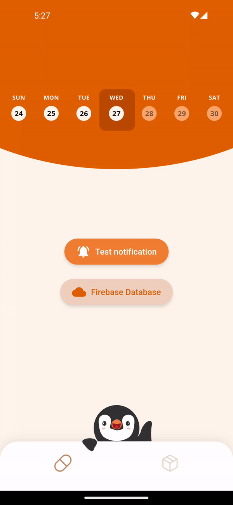
      
Gif 1 - Scrollable Calendar

    </td>
    <td align="center">
      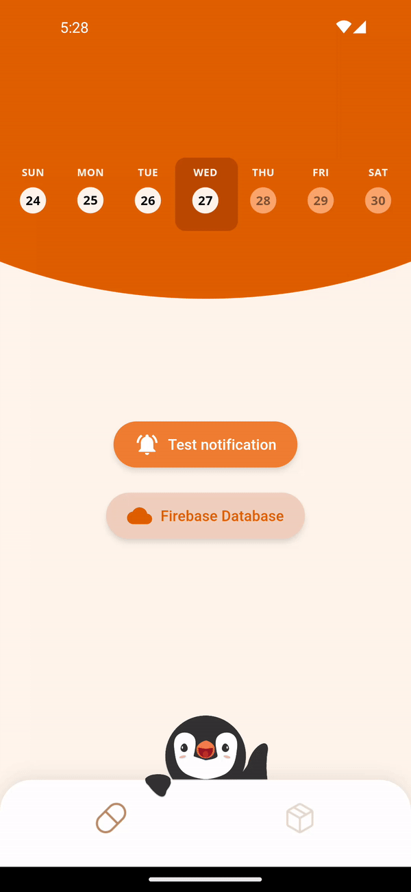
      
Gif 2 - Trigger Notification

    </td>
    <td align="center">
      
      
Gif 3 - Firebase Realtime Database

    </td>
  </tr>
  <tr>
    <td align="center">
      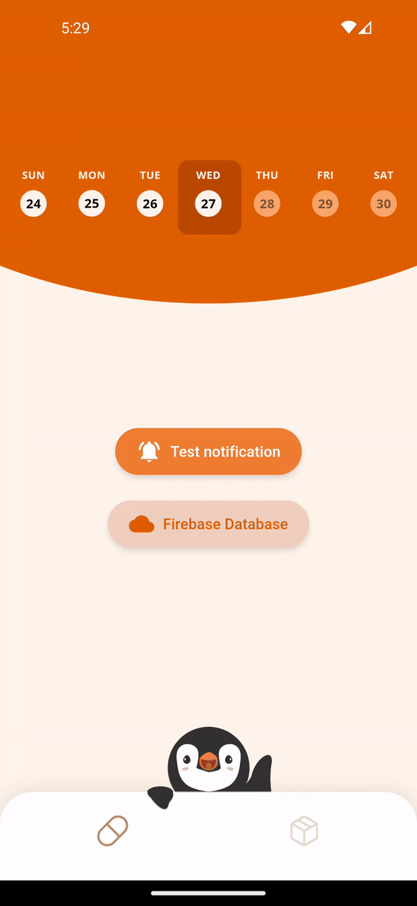
      
Gif 4 - Control Center

    </td>
    <td align="center">
      
      
Gif 5 - Search for Medication

    </td>
    <td align="center">
      
      
Gif 6 - Store User Preferences

    </td>
  </tr>
</table>

### Sprint 1
Increment features that adds value to the end-user.

#### Backlog screenshots
<table>
  <tr>
    <td align="center">
      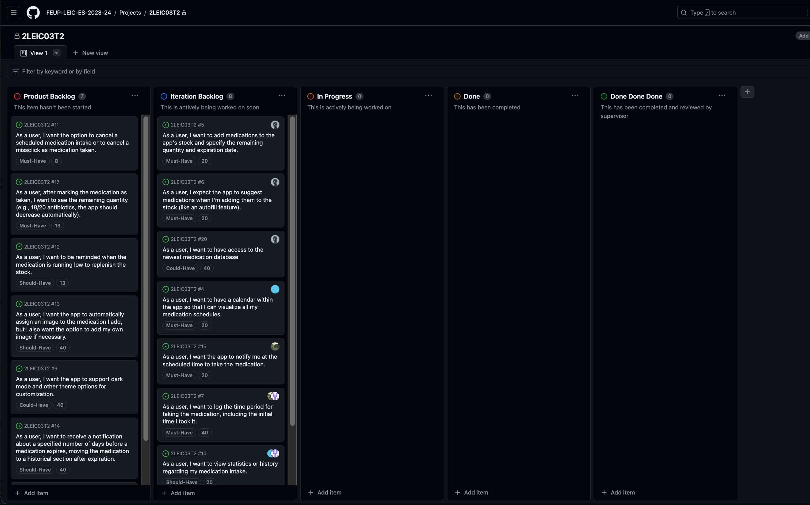
      
Sprint 1 - Initial 0

    </td>
    <td align="center">
      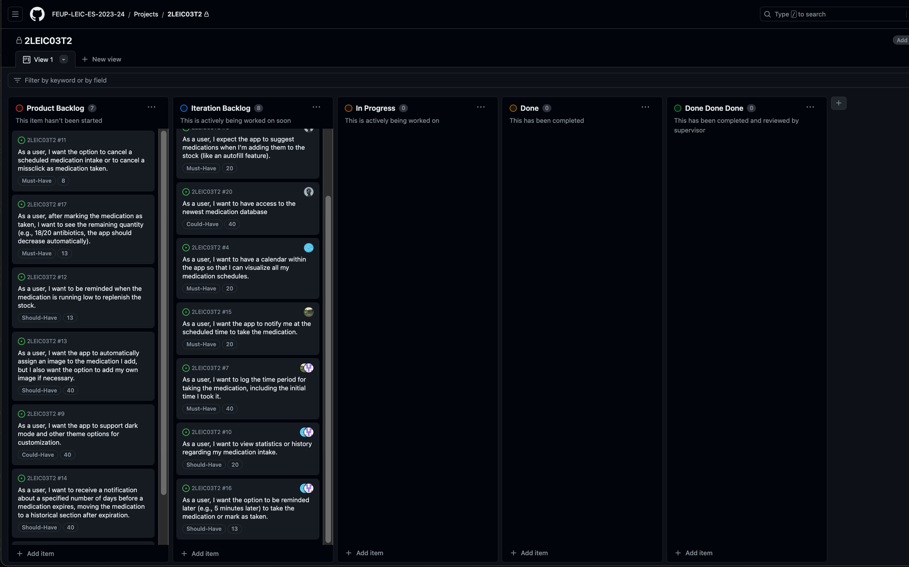
      
Sprint 1 - Initial 1

    </td>
  </tr>
  <tr>
    <td align="center">
      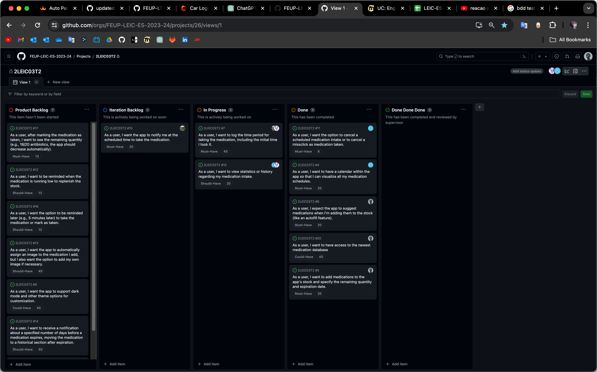
      
Sprint 1 - Final 

    </td>
  </tr>
</table>

#### Implemented User Stories
1. [Calendar within the app to visualize all my medication schedules](https://github.com/orgs/FEUP-LEIC-ES-2023-24/projects/26/views/1?pane=issue&itemId=56155588)

2. [Option to cancel a scheduled medication intake or to cancel a missclick as medication taken](https://github.com/orgs/FEUP-LEIC-ES-2023-24/projects/26/views/1?pane=issue&itemId=56917359)

3. [Have access to the newest medicaments database](https://github.com/orgs/FEUP-LEIC-ES-2023-24/projects/26/views/1?pane=issue&itemId=57633051)

4. [Suggest medicaments when adding a new medicament to the stock (like an autofill)](https://github.com/orgs/FEUP-LEIC-ES-2023-24/projects/26/views/1?pane=issue&itemId=56912518)

5. [Add medicaments to the app's stock and specify the remaining quantity and expiration date](https://github.com/orgs/FEUP-LEIC-ES-2023-24/projects/26/views/1?pane=issue&itemId=56157786)

<table>
  <tr>
    <td align="center">
      
      
Add a new medicament

    </td>
    <td align="center">
      
      
Edit medicament information

    </td>
    <td align="center">
      
      
Undo delete medicament action

    </td>
  </tr>
</table>

#### Reflection
__Reminder:__
Could've implemented local storage when taking medicament upon pressing 'Take' in a medication reminder. So if app was closed and reopened the specific reminder would show as taken and not reset to all as not taken.

The scrolling part of home screen was an issue due to the way calendar and medication reminder widgets were implemented.

__Stock:__
During the implementation of the medicaments stock feature, we encountered several challenges, particularly when integrating it with the real-time Firebase database. Initially, we faced difficulties in understanding why the data was not appearing as expected. Eventually, we realized that our database was quite large, and each request to Firebase required data transfer, putting a strain on network performance. While this issue is common, it was not ideal for our project, as it impacted the user experience. We are gonna try to find another solution to as trying to save as cache the received data if possible.

Another significant portion of our time was spent working on the local database solution. Initially, we attempted to use `shared_preferences` for managing the local medicaments stock, but it did not meet our expectations. Eventually, we transitioned to using `sqflite`, which proved to be more effective and reliable in storing and retrieving data locally.

In terms of UI development, we encountered challenges with the layout of the stock screen, especially with implementing double columns. At the end of all, there are still some non-critical UI errors that need to be addressed, but we plan to address them once all the app features are implemented and tested thoroughly.

### Sprint 2
Increment features that adds value to the end-user.

#### Backlog screenshots
<table>
  <tr>
    <td align="center">
      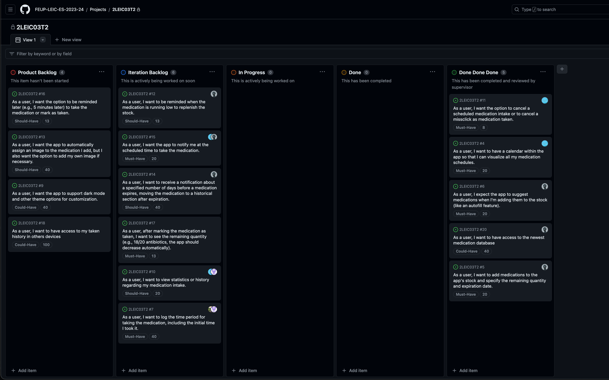
      
Sprint 2 - Initial

    </td>
  </tr>
  <tr>
    <td align="center">
      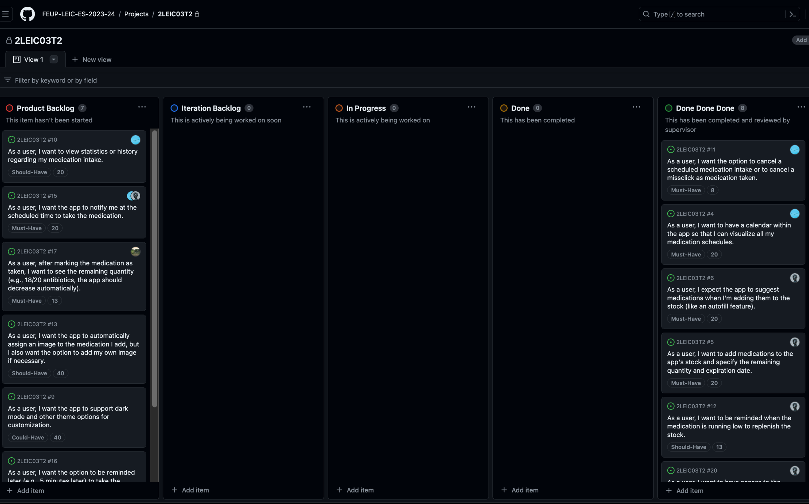
      
Sprint 2 - Final 1

    </td>
    <td align="center">
      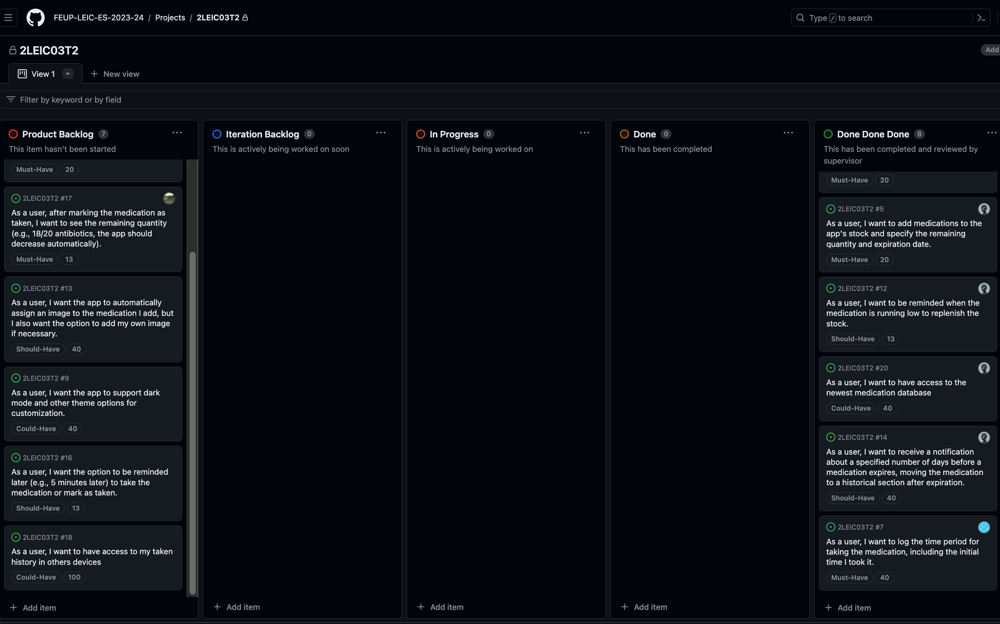
      
Sprint 2 - Final 2

    </td>
  </tr>
</table>

#### Implemented User Stories
1. [Remind user when the medicament is running low to replenish the stock](https://github.com/orgs/FEUP-LEIC-ES-2023-24/projects/26/views/1?pane=issue&itemId=56917478)

<table>
  <tr>
    <td align="center">
      
      
Notification - running low

    </td>
    <td align="center">
      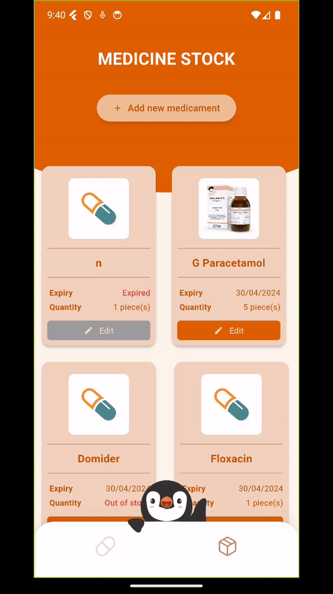
      
Notification - out of stock

    </td>
  </tr>
</table>

2. [Remind user a specified number of days before a medication expires](https://github.com/orgs/FEUP-LEIC-ES-2023-24/projects/26/views/1?pane=issue&itemId=56917507)

3. [Log the time period for taking the medication, including the initial time to took it](https://github.com/orgs/FEUP-LEIC-ES-2023-24/projects/26/views/1?pane=issue&itemId=56913292)

<table>
  <tr>
    <td align="center">
      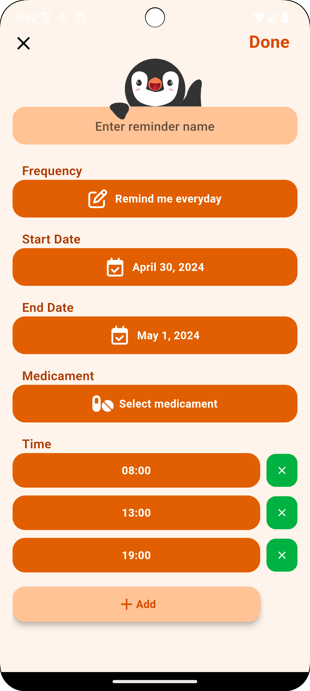
      
Reminder card - add new card

    </td>
    <td align="center">
      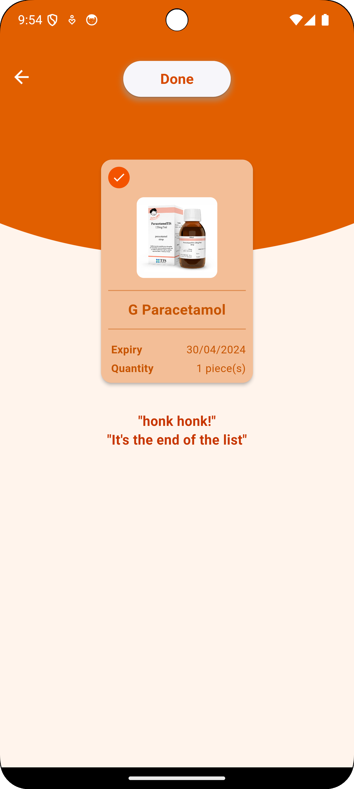
      
Reminder card - select medicament

    </td>
    <td align="center">
      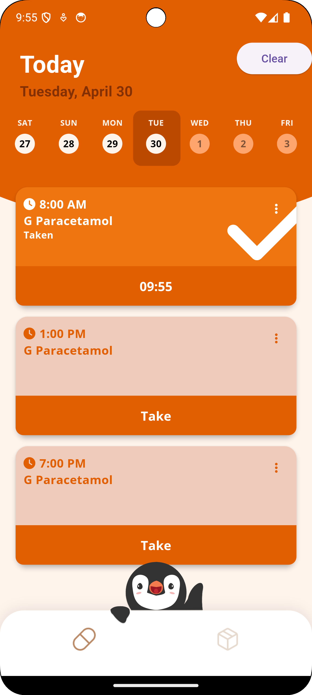
      
Reminder card - show

    </td>
  </tr>
</table>

#### Reflection
__Tests:__
Added some unit tests for the code related to the medicament stock and reminders. However, we hit a snag with testing the notification feature for expired medicaments because it relies on the current system time, making it hard to simulate different scenarios for testing. We'll keep trying on it, but no success guaranteed.

__UI:__
We're struggling to fix the "Pingu\'s" deformation caused by the appearance of the `undo snackbar` at the bottom of the screen. Trying to move the snackbar to the top hasn't worked out; it keeps overflowing the screen.

__Reminders:__
It became apparent that managing the medication intake history, particularly with reminder cards, posed more challenges than initially anticipated. To address this, we realized the necessity of storing each card as an individual object in a local database. This approach enables us to accurately track its "taken" status and intake time, offering a more robust solution.

Initially, our implementation stored reminders as a collective entity, accompanied by a list of times. However, the complexities associated with the reminder cards prompted us to reconsider our approach. Consequently, a significant portion of the existing code required refactoring to accommodate this new requirement.

The difficulties with managing medication intake history, especially with reminder cards, led to incomplete progress on the related user story.

### Sprint 3 & Last
Enhance existing features and finalize incomplete functionalities.

#### Backlog screenshots
<table>
  <tr>
    <td align="center">
      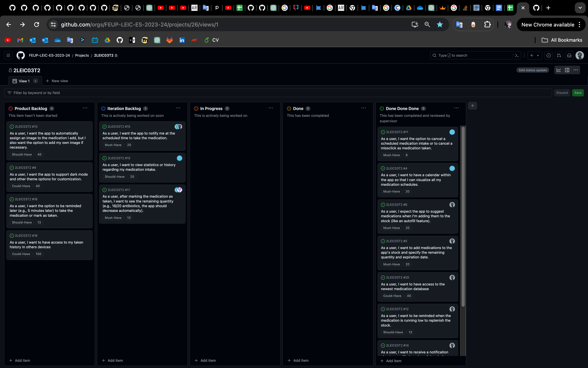
      
Sprint 3 - Initial

    </td>
  </tr>
      <td align="center">
      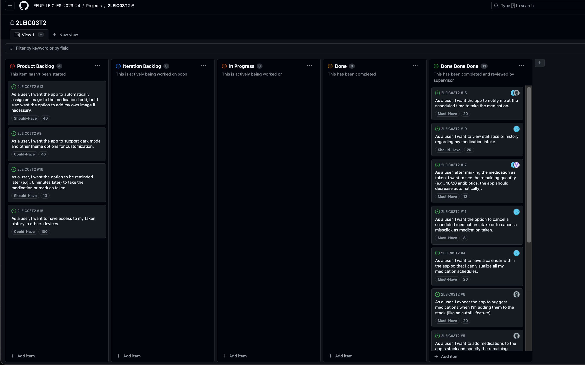
      
Sprint 3 - Final

    </td>
  <tr>
  </tr>
</table>

#### Implemented User Stories
1. [After marking the medication as taken, user is able to see the remaining quantity (e.g., 18/20 antibiotics, the app should decrease automatically)](https://github.com/orgs/FEUP-LEIC-ES-2023-24/projects/26/views/1?pane=issue&itemId=56918540)

2. [User is able to see statistics or history regarding to medication intake](https://github.com/orgs/FEUP-LEIC-ES-2023-24/projects/26/views/1?pane=issue&itemId=56917272)

3. [The app notifies user at the scheduled time to take the medication](https://github.com/orgs/FEUP-LEIC-ES-2023-24/projects/26/views/1?pane=issue&itemId=56918017)

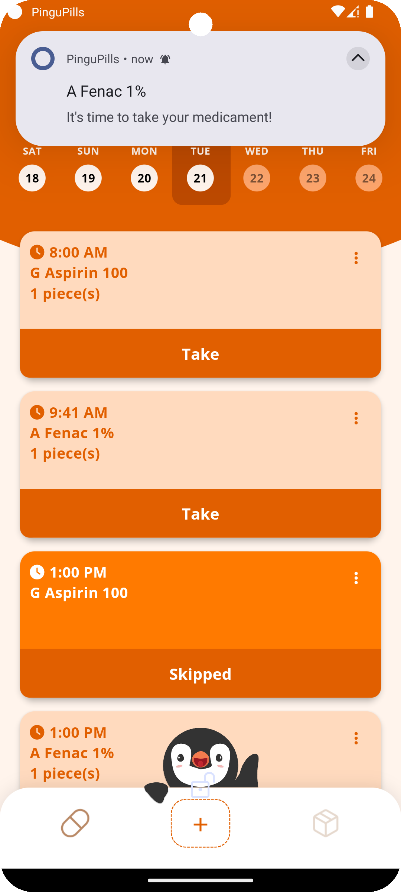

#### Reflection
__Tests:__ Expanded and enhanced the test suite by adding more unit, widget, and integration tests, while also improving the quality of existing tests.

__UI/UX:__ Refined the visual design with minor adjustments and consistent color schemes. Made the control center button more intuitive by replacing the "Pingu button" with a more recognizable "plus" button in the middle of the navigation bar.

## Acknowledgements
The logo was designed by Ricardo Yang.

The medicament database was made by [WSAyan](https://github.com/WSAyan/medicinedb).

 

This project was developed for the "Engenharia de Software" (ES) course at @FEUP

Special thanks to Professor [José Campos](https://sigarra.up.pt/feup/en/FUNC_GERAL.FORMVIEW?p_codigo=480945) for guidance and support throughout the course.
