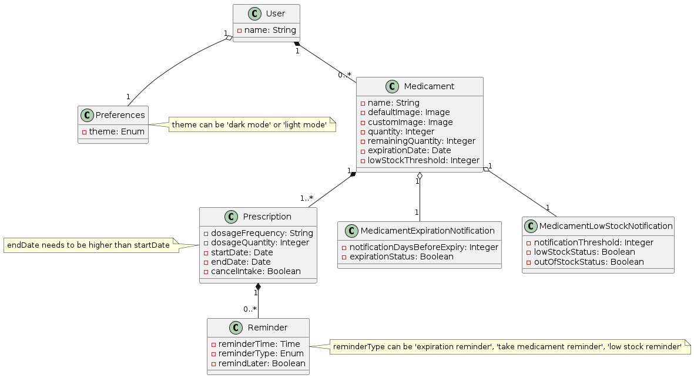
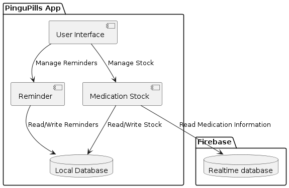
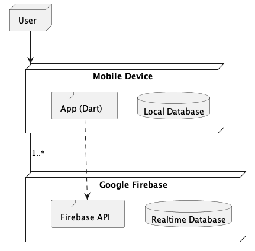

# PINGUPILLS

Struggling to remember your medication schedule? Unsure about your pill count at home? Look no further – PINGU has got you covered! Set alarms to ensure you never miss a dose again and effortlessly keep track of your medicine stock. 

Let's embrace a healthy lifestyle with __PINGUPILLS__!

⚠️ [Report Template](https://github.com/FEUP-LEIC-ES-2023-24/templates) ⚠️

### 2LEIC03T2

- Bruno Huang - 202207517
- Diogo Pinto - 202205225
- Eriton Naife - 202008859
- Ricardo Yang - 202208465

### Features
- Keep track of medications that you have at home
- Reminder for you to take your medications
- One click to have the medication marked as taken 
- Quick visualization of the remaining medication stock and expiration day
- Reminder for close to expiration day and stock replenishment
- A simple calendar to see medication intake in specific day

## Requirements

### Domain Model

### Use Case Diagram

## Architecture and design

### Logical

### Physical

### Vertical Prototype
Develop screens showcasing various features for demonstration purposes.

> Delivery Date: March 27th

> ✅ Done

List of technologies to use:
- __✅ UI and buttons:__ Colors and Icons combinations.
- __System Notification Button:__ Create a button that, when clicked, triggers a system notification to test the notification feature.
- __✅ Search Box with Suggestions:__ Implement a search box with suggestions. Create list/array with words to provide suggestions as the user types.
- __✅ Animations:__ Implement an animated pop-up that slides in from the bottom when opened, adding a visually appealing transition effect.
- __Local Preferences:__ Allow users to input a value, which is stored locally. After app restarts, the value should remains saved.
- __Calendar Scroll:__ Develop a scrollable list of numbers resembling a calendar. Users can scroll horizontally to navigate through dates.
- __Firebase__ (setup)
