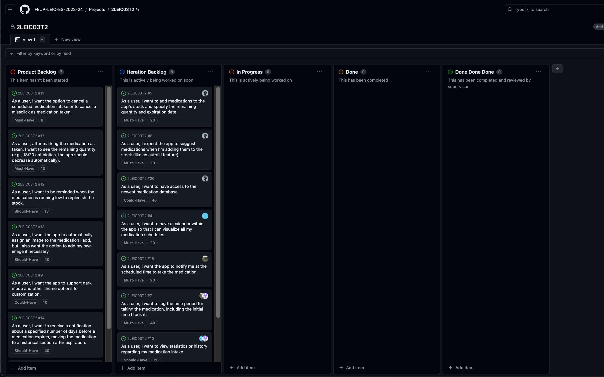
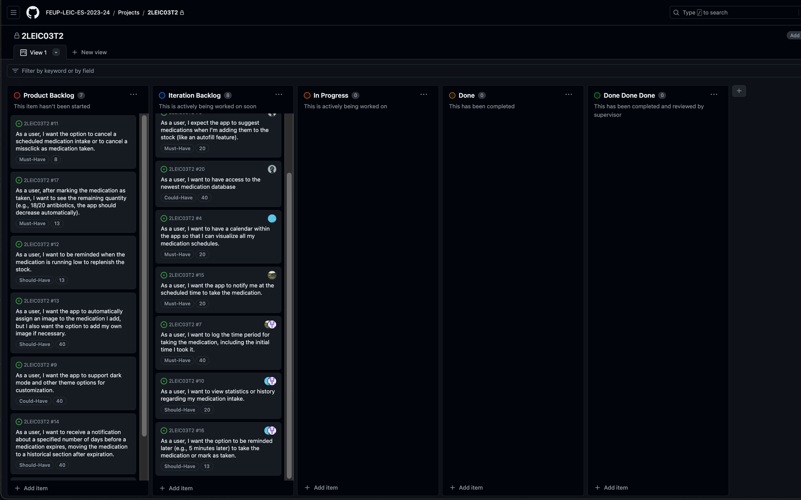

# PINGUPILLS 🐧

Struggling to remember your medication schedule? Unsure about your pill count at home? Look no further – PINGU has got you covered! Set alarms to ensure you never miss a dose again and effortlessly keep track of your medicine stock. 

🚀 Let's embrace a healthy lifestyle with __PINGUPILLS__!

## Team 2LEIC03T2

|  Name         |  ID         |
|---------------|-------------|
| Bruno Huang   | 202207517   |
| Diogo Pinto   | 202205225   |
| Eriton Naife  | 202008859   |
| Ricardo Yang  | 202208465   |

## Features
- Keep track of medications that you have at home
- Reminder for you to take your medications
- One click to have the medication marked as taken 
- Quick visualization of the remaining medication stock and expiration day
- Reminder for close to expiration day and stock replenishment
- A simple calendar to see medication intake in specific day

## Requirements

### Domain Model
- `Medication`: Represents individual medications, including attributes like name, quantity, expiration date, and associated images.
- `Prescription`: Describes prescription details such as dosage frequency, quantity, and duration. Each medication can have multiple prescriptions.
- `Reminder`: Stores reminder settings linked to prescriptions, specifying reminder time and type. Multiple reminders can be associated with a single prescription.
- `Preferences`: Holds user-specific preferences, such as theme settings.
- `User`: Represents user information, including name. Users can have multiple medications associated with them.
- `MedicationExpirationNotification`: Tracks medication expiration status and allows setting notification days before expiry. Each medication has an associated expiration notification.
- `MedicationLowStockNotification`: Manages medication stock status, including low stock and out-of-stock notifications. Each medication has an associated low stock notification.

### Use Case Diagram

## Architecture and design

### Logical
Users engage through an **User Interface (UI)**, managing medication routines effortlessly. The **Reminder feature** allows users to set and manage medication schedules seamlessly. **Medication Stock** ensures a continuous supply of medications. The **Local Database** stores personalized data like reminder settings and medication inventory locally on the device.

The application extends its capabilities by integrating with a **Realtime Database** from **Firebase**. This integration enables **seamless synchronization** of medication information across users, providing access to **up-to-date medication details**.

### Physical
The **mobile device** acts as **interaction platform** between the **user** and the **system**, hosting essential components such as the **Dart-based application**. **User-specific data** is stored directly on the device through a **Local Database**, ensuring **quick access** and **optimized performance**. Integration with **Google Firebase** enhances the system with **cloud-based services**, facilitating **seamless communication** and **data synchronization** across devices.

- The **Firebase API** facilitates communication between the application and **Firebase services**.
- The **Realtime Database** acts as a **centralized repository**, ensuring **real-time synchronization** across devices and enhancing functionality.

### Vertical Prototype
Develop screens showcasing various features for demonstration purposes.

- __UI and buttons:__ Colors and Icons combinations.
- __System Notification Button:__ Create a button that, when clicked, triggers a system notification to test the notification feature.
- __Search Box with Suggestions:__ Implement a search box with suggestions. Create list/array with words to provide suggestions as the user types.
- __Animations:__ Implement an animated pop-up that slides in from the bottom when opened, adding a visually appealing transition effect.
- __Local Preferences:__ Allow users to input a value, which is stored locally. After app restarts, the value should remains saved.
- __Calendar Scroll:__ Develop a scrollable list of numbers resembling a calendar. Users can scroll horizontally to navigate through dates.
- __Firebase:__ Access the Real-Time Database provided by Firebase to fetch and display data in the app.

<table>
  <tr>
    <td align="center">
      
      
Gif 1 - Scrollable Calendar

    </td>
    <td align="center">
      
      
Gif 2 - Trigger Notification

    </td>
    <td align="center">
      
      
Gif 3 - Firebase Realtime Database

    </td>
  </tr>
  <tr>
    <td align="center">
      
      
Gif 4 - Control Center

    </td>
    <td align="center">
      
      
Gif 5 - Search for Medication

    </td>
    <td align="center">
      
      
Gif 6 - Store User Preferences

    </td>
  </tr>
</table>

### Backlog
<table>
  <tr>
    <td align="center">
      
      
Beginning 0

    </td>
    <td align="center">
      
      
Beginning 1

    </td>
    <td align="center">
      
      
Beginning 2

    </td>
  </tr>
  <tr>
    <td align="center">
      
      
Sprint 0 - Initial 0

    </td>
    <td align="center">
      
      
Sprint 0 - Initial 1

    </td>
  </tr>
</table>
