## MOCKUPS
Mockups created in [Figma](https://www.figma.com/file/qMeErr0JtWtYGfH0MOQVOe/PinguPills?type=design&node-id=0%3A1&mode=design&t=NM5ZBWsMYzxWpchM-1)

|||||
|:------------------------------------:|:--------------------------------------:|:------------------------------------:|:--------------------------------------:|
| 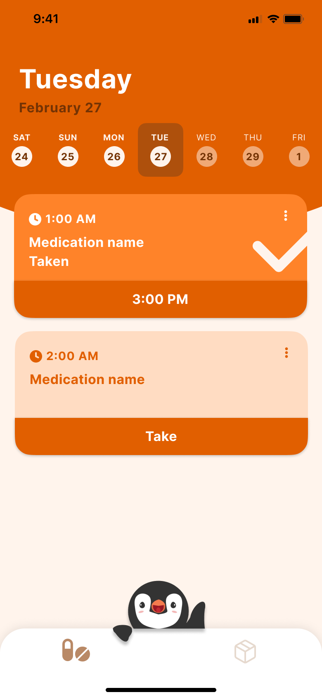 | 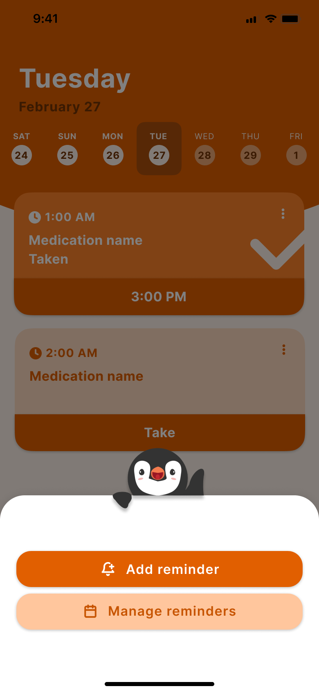 | 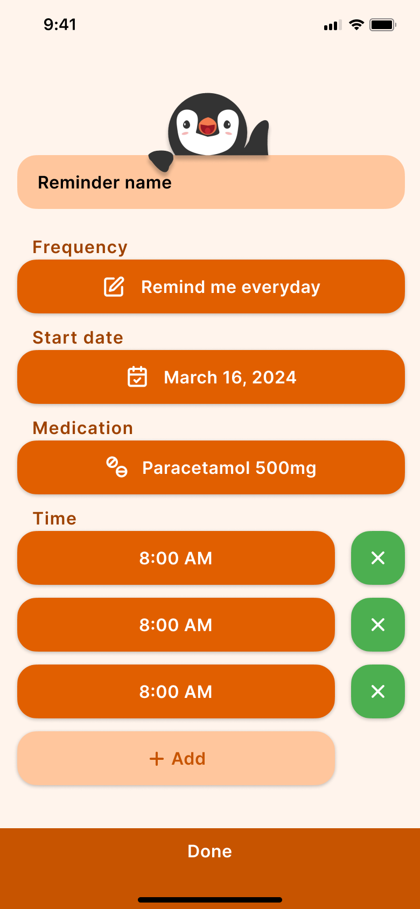 | 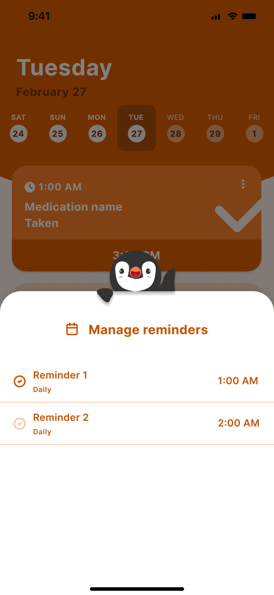 |
|            Mockup - main screen            |           Mockup - control center           |             Mockup - add reminder           |        Mockup - manage reminders         |
|  | 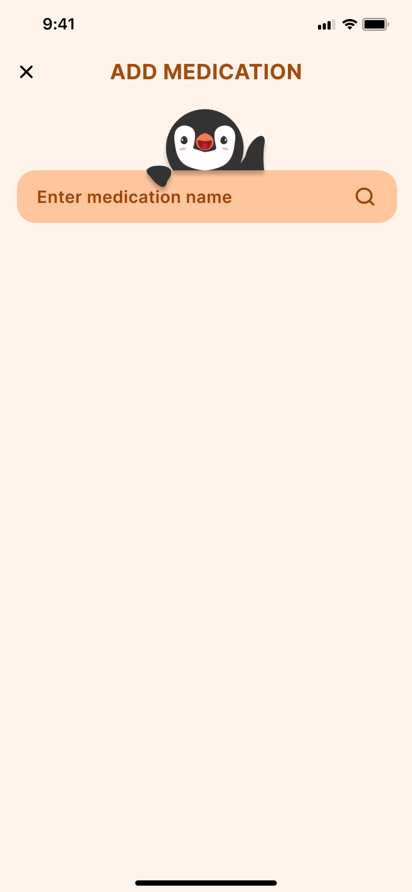 |  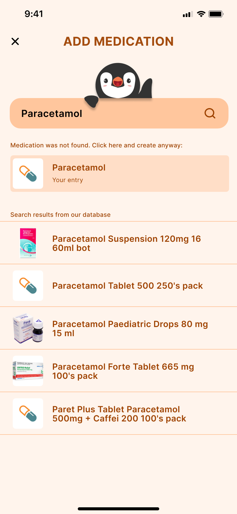 | 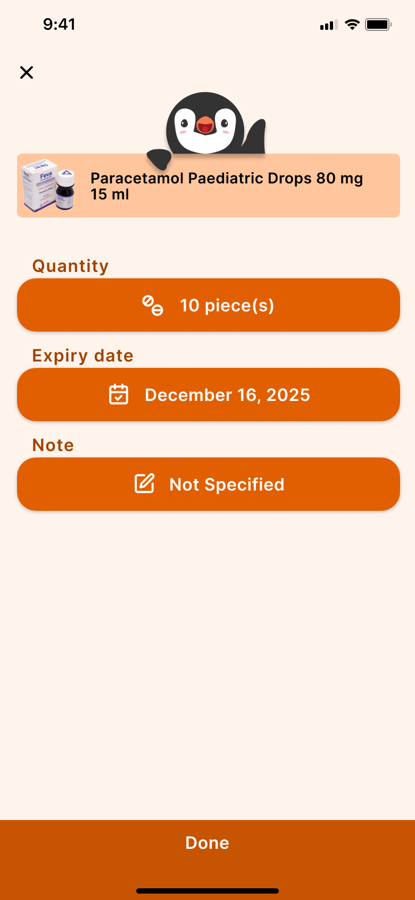 |
|            Mockup - stock screen           |       Mockup - add medication 01        |       Mockup - add medication 02          |       Mockup - add medication 03       |
|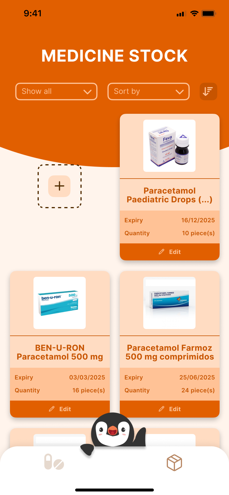|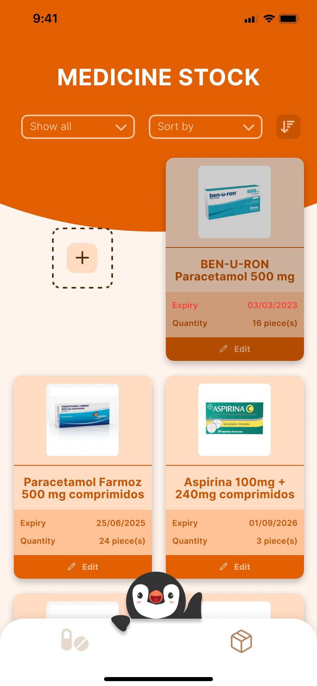|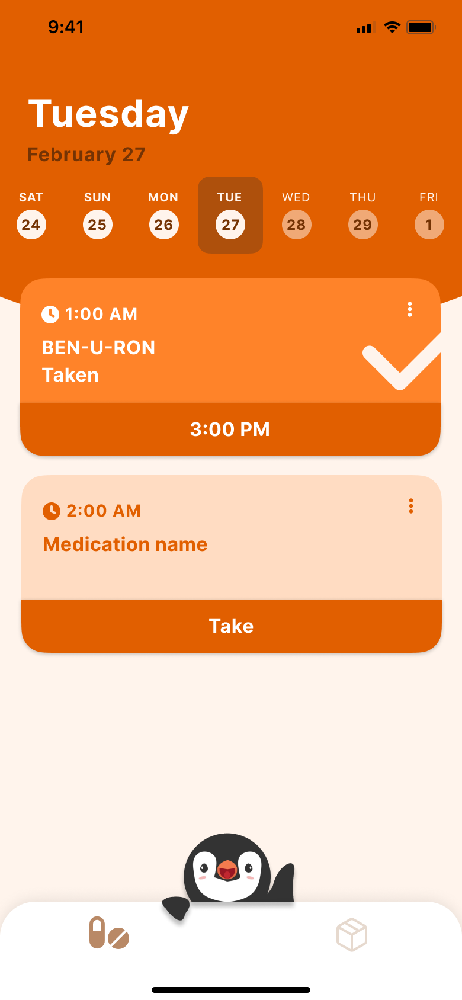|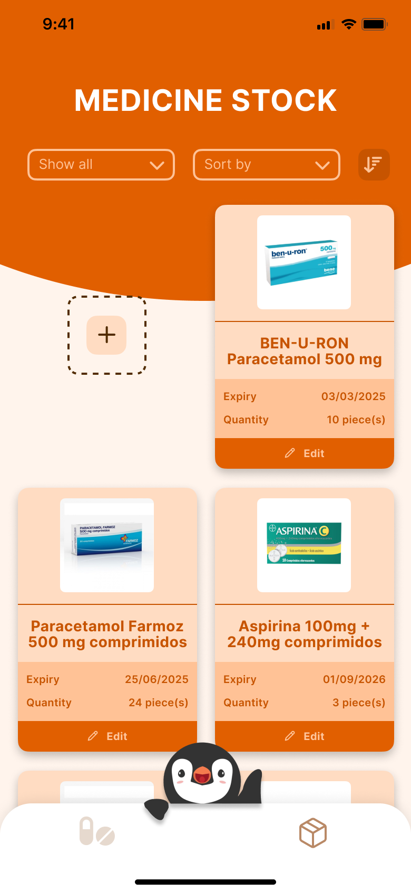|
|Mockup - add medication 04|Mockup - medication expired|Mockup - medication taken 1|Mockup - medication taken 2|
|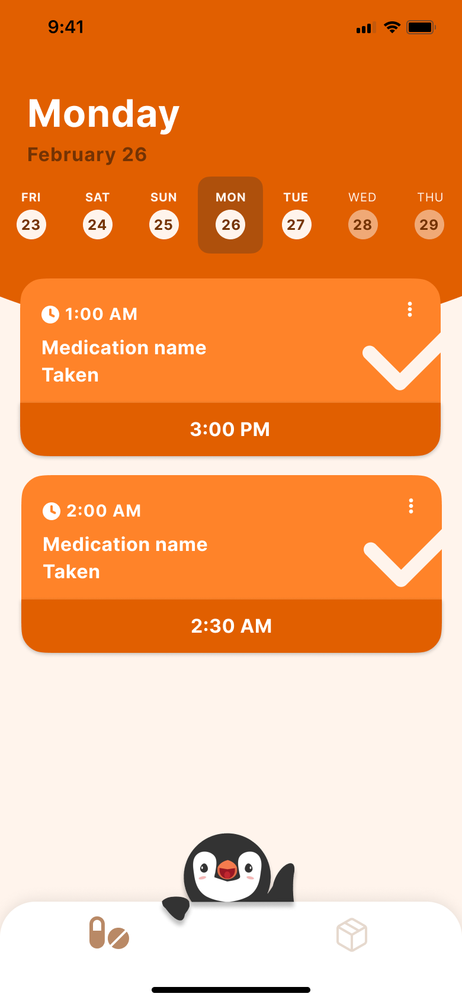|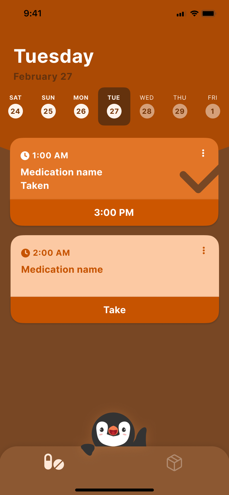|||
|Mockup - calendar history|Mockup - dark mode|||

